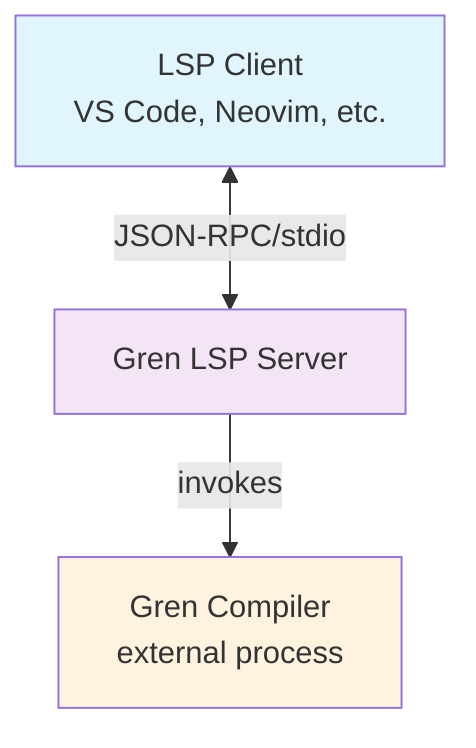

# Gren LSP Server Architecture

## Overview

The Gren Language Server is built using Rust with the async-lsp crate for asynchronous LSP support and the lsp-types crate for comprehensive LSP type definitions. The architecture emphasizes correctness, performance, and maintainability while leveraging Gren's deterministic language characteristics.

## Key Dependencies

- **async-lsp**: Asynchronous Language Server Protocol framework with tower middleware support
- **lsp-types**: Complete LSP 3.16 type definitions with optional 3.17 proposed features
- **lsp-textdocument**: Document lifecycle management and incremental edit handling
- **tree-sitter**: Syntax parsing and structural analysis
- **tokio**: Async runtime for concurrent request handling
- **serde**: JSON serialization/deserialization for LSP protocol
- **sqlx**: Async SQLite database operations for symbol indexing

## High-Level Architecture



## Core Components

### 1. LSP Service Layer

**Framework**: async-lsp crate + lsp-types crate
- **LspService Implementation**: Core service trait handling LSP requests and notifications
- **Message Router**: Dispatches incoming JSON-RPC messages to appropriate handlers
- **Type System**: Uses lsp-types for all LSP protocol structures (requests, responses, notifications)
- **Capability Manager**: Negotiates and tracks client/server capabilities using `ClientCapabilities` and `ServerCapabilities`
- **Error Handler**: Manages LSP-level errors using `lsp_types::error_codes` constants

**Key Characteristics**:
- Asynchronous request handling for concurrent processing
- Synchronous notification handling to maintain correct ordering
- Tower-based middleware support for cross-cutting concerns
- Built-in JSON-RPC 2.0 protocol handling
- Type-safe LSP protocol implementation with compile-time guarantees

**Type Integration**:
```rust
use lsp_types::{
    ClientCapabilities, ServerCapabilities, InitializeParams, InitializeResult,
    CompletionParams, CompletionResponse, HoverParams, Hover,
    DefinitionParams, DefinitionResponse, Position, Range, TextDocumentItem,
    DidOpenTextDocumentParams, DidChangeTextDocumentParams, PublishDiagnosticsParams,
};
use async_lsp::{LspService, ClientSocket, LanguageServer};
```

### 2. Document Manager

**Framework**: lsp-textdocument crate + custom extensions
- **TextDocuments**: Manages document lifecycle and incremental synchronization
- **FullTextDocument**: Handles individual document content and UTF-16 position encoding
- **Tree-sitter Integration**: Custom layer for syntax tree management
- **Position Conversion**: Automatic handling of offset-to-position mappings

**Responsibilities**:
- Track all open text documents with their content and versions
- Apply incremental and full document changes using proven algorithms
- Maintain document state consistency with UTF-16 position encoding
- Provide document access and position calculations to other components
- Cache parse trees and invalidate them on content changes

**Implementation Details**:
```rust
use lsp_types::{Url, TextDocumentItem, VersionedTextDocumentIdentifier, TextDocumentContentChangeEvent};
use lsp_textdocument::{TextDocuments, FullTextDocument};

pub struct DocumentManager {
    text_documents: TextDocuments,
    parse_trees: HashMap<Url, Tree>, // Tree-sitter parse trees
    lru_cache: LruCache<Url, FullTextDocument>, // For closed documents
    parser: Parser, // Tree-sitter parser
}

impl DocumentManager {
    pub fn new() -> Self {
        Self {
            text_documents: TextDocuments::new(),
            parse_trees: HashMap::new(),
            lru_cache: LruCache::new(100),
            parser: Parser::new(),
        }
    }

    pub fn did_open(&mut self, params: DidOpenTextDocumentParams) -> Result<(), DocumentError> {
        let uri = &params.text_document.uri;

        // Let lsp-textdocument handle the document lifecycle
        self.text_documents.listen(lsp_types::notification::DidOpenTextDocument::METHOD, params)?;

        // Parse the initial content
        self.update_parse_tree(uri)?;

        Ok(())
    }

    pub fn did_change(&mut self, params: DidChangeTextDocumentParams) -> Result<(), DocumentError> {
        let uri = &params.text_document.uri;

        // Let lsp-textdocument handle incremental updates
        self.text_documents.listen(lsp_types::notification::DidChangeTextDocument::METHOD, params)?;

        // Update parse tree incrementally if possible
        self.update_parse_tree(uri)?;

        Ok(())
    }

    pub fn get_document_content(&self, uri: &Url) -> Option<String> {
        self.text_documents.get_document_content(uri, None)
    }

    pub fn get_position_from_offset(&self, uri: &Url, offset: usize) -> Option<Position> {
        let document = self.text_documents.get_document(uri)?;
        document.position_at(offset)
    }

    pub fn get_offset_from_position(&self, uri: &Url, position: Position) -> Option<usize> {
        let document = self.text_documents.get_document(uri)?;
        document.offset_at(position)
    }

    pub fn get_parse_tree(&self, uri: &Url) -> Option<&Tree> {
        self.parse_trees.get(uri)
    }

    fn update_parse_tree(&mut self, uri: &Url) -> Result<(), DocumentError> {
        let content = self.get_document_content(uri).ok_or(DocumentError::NotFound)?;

        if let Some(old_tree) = self.parse_trees.get(uri) {
            // Use incremental parsing when possible
            let new_tree = self.parser.parse(&content, Some(old_tree))?;
            self.parse_trees.insert(uri.clone(), new_tree);
        } else {
            // Full parse for new documents
            let tree = self.parser.parse(&content, None)?;
            self.parse_trees.insert(uri.clone(), tree);
        }

        Ok(())
    }
}

#[derive(Debug, thiserror::Error)]
pub enum DocumentError {
    #[error("Document not found")]
    NotFound,
    #[error("Parse error: {0}")]
    ParseError(String),
    #[error("Position encoding error")]
    PositionError,
}
```

**Features**:
- **Proven Document Management**: Uses lsp-textdocument's battle-tested incremental update algorithms
- **UTF-16 Position Encoding**: Automatic handling of LSP's UTF-16 position requirements
- **Offset/Position Conversion**: Built-in conversion between byte offsets and line/column positions
- **LRU cache for recently closed documents** (default: 100 items)
- **Atomic document updates** to prevent race conditions
- **Incremental parsing with tree-sitter** for optimal performance
- **Version tracking** to handle out-of-order messages

**Advantages of lsp-textdocument Integration**:
- **Reliability**: Based on VS Code's text document implementation
- **Performance**: Optimized incremental text synchronization algorithms
- **Standards Compliance**: Handles LSP specification nuances correctly
- **Position Mapping**: Eliminates common bugs in UTF-16 offset calculations
- **Maintenance**: Delegates complex document state management to a dedicated library

### 3. Tree-sitter Parser

**Purpose**: Provide structural analysis of Gren code without regex patterns

**Implementation Prerequisites**:
Before implementing any tree-sitter functionality, a baseline AST capture must be established:

1. **Create Comprehensive Test File**: Develop a complete Gren source file (`docs/tree-sitter-ast/reference.gren`) that exercises all language constructs:
   - Module declarations and imports
   - Function definitions with type annotations
   - Custom type definitions and variants
   - Record types and record updates
   - Pattern matching with all patterns
   - Let expressions and local bindings
   - Case expressions with guards
   - Comments (single-line and multi-line)
   - String literals and interpolation
   - Number literals (integers, floats, hex)
   - Array and record literals
   - Pipe operators and function composition
   - All operators and precedence levels

2. **Generate Reference AST**: Use tree-sitter CLI to parse the reference file and capture the complete AST structure:
   ```bash
   tree-sitter parse docs/tree-sitter-ast/reference.gren > docs/tree-sitter-ast/baseline.ast
   ```

3. **Document AST Structure**: Create `docs/tree-sitter-ast/README.md` explaining:
   - Node types and their purposes
   - Field names and their meanings  
   - Query patterns for common language constructs
   - Expected AST patterns for each language feature

**Components**:
- **Parser Instance**: Tree-sitter parser configured for Gren grammar
- **Query Engine**: Execute tree-sitter queries for symbol extraction
- **Incremental Updates**: Apply changes efficiently to existing parse trees
- **Error Recovery**: Handle partial/invalid syntax gracefully

**Core Queries**:
```scheme
;; Function definitions
(function_declaration
  name: (identifier) @function.name
  parameters: (parameter_list) @function.params
  body: (_) @function.body)

;; Import statements
(import_declaration
  module: (module_name) @import.module
  exposing: (exposing_list) @import.exposing)

;; Type definitions
(type_declaration
  name: (identifier) @type.name
  variants: (_) @type.variants)
```

### 4. Symbol Index

**Storage**: SQLite database for persistent symbol information

**Schema**:
```sql
CREATE TABLE symbols (
    id INTEGER PRIMARY KEY,
    name TEXT NOT NULL,
    kind INTEGER NOT NULL,
    uri TEXT NOT NULL,
    range_start_line INTEGER NOT NULL,
    range_start_char INTEGER NOT NULL,
    range_end_line INTEGER NOT NULL,
    range_end_char INTEGER NOT NULL,
    container TEXT,
    signature TEXT,
    documentation TEXT,
    created_at TIMESTAMP DEFAULT CURRENT_TIMESTAMP
);

CREATE INDEX idx_symbols_name ON symbols(name);
CREATE INDEX idx_symbols_uri ON symbols(uri);
CREATE INDEX idx_symbols_kind ON symbols(kind);
```

**Operations**:
- **Indexing**: Extract symbols from parse trees and store in database
- **Querying**: Fast symbol lookups by name, location, or type
- **Updates**: Incremental updates when files change
- **Cross-references**: Track symbol relationships across modules

### 5. Compiler Interface

**Integration Model**: External process invocation
- **Process Management**: Spawn and manage Gren compiler processes
- **Temporary Files**: Write in-memory documents to temp files for compilation
- **Output Parsing**: Parse compiler JSON output for diagnostics
- **Error Handling**: Robust handling of compiler failures

**Implementation**:
```rust
use lsp_types::{Diagnostic, DiagnosticSeverity, Position, Range, Url};

struct CompilerInterface {
    compiler_path: PathBuf,
    temp_dir: TempDir,
    process_pool: Pool<CompilerProcess>,
}

struct CompileRequest {
    file_path: PathBuf,
    content: String,
    project_root: PathBuf,
}

struct CompileResult {
    success: bool,
    diagnostics: Vec<Diagnostic>, // Uses lsp_types::Diagnostic
    symbols: Vec<Symbol>,
    dependencies: Vec<ModuleDependency>,
}

impl CompileResult {
    fn to_publish_diagnostics(&self, uri: Url, version: Option<i32>) -> PublishDiagnosticsParams {
        PublishDiagnosticsParams {
            uri,
            version,
            diagnostics: self.diagnostics.clone(),
        }
    }
}
```

### 6. Language Feature Handlers

All handlers use lsp-types for type-safe parameter handling and response construction.

#### Completion Handler
```rust
use lsp_types::{CompletionParams, CompletionResponse, CompletionItem, CompletionItemKind, MarkupContent};

async fn handle_completion(&self, params: CompletionParams) -> Result<Option<CompletionResponse>, LspError> {
    let position = params.text_document_position.position;
    let uri = params.text_document_position.text_document.uri;

    // Trigger analysis, scope resolution, import analysis, filtering
    let items = self.get_completion_items(&uri, position).await?;

    Ok(Some(CompletionResponse::Array(items)))
}
```

#### Hover Handler
```rust
use lsp_types::{HoverParams, Hover, MarkupContent, MarkupKind};

async fn handle_hover(&self, params: HoverParams) -> Result<Option<Hover>, LspError> {
    let position = params.text_document_position_params.position;
    let uri = params.text_document_position_params.text_document.uri;

    // Symbol resolution, type inference, documentation lookup
    if let Some((content, range)) = self.get_hover_info(&uri, position).await? {
        Ok(Some(Hover {
            contents: lsp_types::HoverContents::Markup(MarkupContent {
                kind: MarkupKind::Markdown,
                value: content,
            }),
            range: Some(range),
        }))
    } else {
        Ok(None)
    }
}
```

#### Definition Handler
```rust
use lsp_types::{GotoDefinitionParams, GotoDefinitionResponse, Location, LocationLink};

async fn handle_definition(&self, params: GotoDefinitionParams) -> Result<Option<GotoDefinitionResponse>, LspError> {
    let position = params.text_document_position_params.position;
    let uri = params.text_document_position_params.text_document.uri;

    // Symbol identification, cross-module resolution, package resolution
    let locations = self.find_definitions(&uri, position).await?;

    if locations.is_empty() {
        Ok(None)
    } else {
        Ok(Some(GotoDefinitionResponse::Array(locations)))
    }
}
```

#### References Handler
```rust
use lsp_types::{ReferenceParams, Location};

async fn handle_references(&self, params: ReferenceParams) -> Result<Option<Vec<Location>>, LspError> {
    let position = params.text_document_position.position;
    let uri = params.text_document_position.text_document.uri;
    let include_declaration = params.context.include_declaration;

    // Symbol usage analysis, scope analysis, package boundaries
    let references = self.find_references(&uri, position, include_declaration).await?;

    if references.is_empty() {
        Ok(None)
    } else {
        Ok(Some(references))
    }
}
```

#### Diagnostics Handler
```rust
use lsp_types::{PublishDiagnosticsParams, Diagnostic, DiagnosticSeverity};

async fn publish_diagnostics(&self, uri: Url, version: Option<i32>) {
    // Compiler integration, error classification, range mapping
    let diagnostics = self.compute_diagnostics(&uri).await.unwrap_or_default();

    let params = PublishDiagnosticsParams {
        uri,
        version,
        diagnostics,
    };

    self.client.publish_diagnostics(params).await;
}
```

## Data Flow Architecture

### 1. Request Processing Flow

```
Client Request → LSP Service → Message Router → Feature Handler
                    ↓
              Document Manager ← Tree-sitter Parser
                    ↓
                Symbol Index → Query Results
                    ↓
              Compiler Interface (if needed)
                    ↓
              Response Formation → LSP Service → Client
```

### 2. Document Synchronization Flow

```
didOpen/didChange → lsp-textdocument → Document Manager → Tree-sitter Update
                         ↓                    ↓
                   UTF-16 Position       Position/Offset
                    Handling              Conversion
                         ↓                    ↓
                   Symbol Index Update ← Parse Tree
                         ↓
                  Compiler Invocation (async)
                         ↓
               Diagnostics Publication → Client
```

### 3. Symbol Resolution Flow

```
Cursor Position → Tree-sitter Query → Local Symbol?
                        ↓                    ↓
                   Symbol Index Query    Return Local
                        ↓
                Cross-Module Resolution
                        ↓
                Package Resolution
                        ↓
                  Final Location
```

## Concurrency Model

### Async Request Handling
- **Request Processing**: Concurrent handling of LSP requests
- **Resource Sharing**: Arc<Mutex<T>> for shared state
- **Blocking Operations**: Spawn blocking tasks for compiler calls
- **Backpressure**: Request queuing and cancellation support

### Synchronous Notifications
- **Document Updates**: Processed sequentially to maintain consistency
- **State Mutations**: Serialized access to document and symbol state
- **Event Ordering**: Maintain correct ordering of notifications

### Background Tasks
- **Indexing**: Background symbol indexing for large projects
- **Compilation**: Asynchronous compilation with result caching
- **File Watching**: Monitor file system changes for non-open files

## Error Handling Strategy

### LSP Protocol Errors
```rust
use lsp_types::{error_codes, ResponseError};

pub enum LspError {
    ParseError,
    InvalidRequest,
    MethodNotFound,
    InvalidParams,
    InternalError,
    ServerNotInitialized,
    UnknownErrorCode,
    ContentModified,
}

impl From<LspError> for ResponseError {
    fn from(error: LspError) -> Self {
        match error {
            LspError::ParseError => ResponseError {
                code: error_codes::PARSE_ERROR,
                message: "Parse error".to_string(),
                data: None,
            },
            LspError::InvalidRequest => ResponseError {
                code: error_codes::INVALID_REQUEST,
                message: "Invalid request".to_string(),
                data: None,
            },
            LspError::MethodNotFound => ResponseError {
                code: error_codes::METHOD_NOT_FOUND,
                message: "Method not found".to_string(),
                data: None,
            },
            LspError::ServerNotInitialized => ResponseError {
                code: error_codes::SERVER_NOT_INITIALIZED,
                message: "Server not initialized".to_string(),
                data: None,
            },
            // ... other error mappings
        }
    }
}
```

### Recovery Mechanisms
- **Partial Results**: Return available information when possible
- **Graceful Degradation**: Disable features on errors, not entire server
- **State Recovery**: Rebuild state from documents on corruption
- **Client Communication**: Inform client of capability changes

### Logging and Monitoring

#### Logging Levels and Guidelines
The LSP server uses structured logging with four distinct levels:

**DEBUG Level** - Point-by-point diagnostic information:
```rust
log::debug!("Parsing tree-sitter node: {:?} at position {}:{}", node_kind, line, col);
log::debug!("  Found identifier: {}", identifier_name);
log::debug!("  Node children: {}", child_count);
log::debug!("Symbol '{}' found in scope at depth {}", symbol_name, scope_depth);
log::debug!("  Scope type: {}", scope_type);
log::debug!("  Parent scope: {}", parent_scope);
log::debug!("Test assertion: expected completion count {}, got {}", expected, actual);
log::debug!("  Item 0: {}", item_labels[0]);
log::debug!("  Item 1: {}", item_labels[1]);
log::debug!("Cache hit for document URI: {}", uri);
```

**INFO Level** - Main system checkpoints and LSP protocol activity:
```rust
log::info!("📨 LSP message received: {}", method_name);
log::info!("  Request ID: {}", request_id);
log::info!("  Parameters: {} bytes", param_size);
log::info!("📤 LSP response sent: {} ({}ms)", method_name, duration);
log::info!("  Response size: {} bytes", response_size);
log::info!("✅ Server initialized with capabilities: {:?}", capabilities);
log::info!("  Text sync: {}", sync_kind);
log::info!("  Completion triggers: {:?}", trigger_chars);
log::info!("📄 Document opened: {}", uri);
log::info!("  Language: {}", language_id);
log::info!("  Version: {}", version);
log::info!("🔨 Compilation started for project: {}", project_root);
log::info!("  Compiler path: {}", compiler_path);
log::info!("  Files to compile: {}", file_count);
log::info!("🧪 Test suite started: {}", test_name);
log::info!("  Test files: {}", test_file_count);
log::info!("  Setup helpers: {:?}", setup_helpers);
```

**WARNING Level** - Recoverable issues with alternatives:
```rust
log::warn!("⚠️  Parse tree incomplete, using cached version for {}", uri);
log::warn!("  Missing nodes: {}", missing_node_count);
log::warn!("  Cache age: {}ms", cache_age);
log::warn!("⚠️  Compiler took {}ms (>5000ms threshold), results may be stale", duration);
log::warn!("  File size: {} KB", file_size);
log::warn!("  Memory usage: {} MB", memory_usage);
log::warn!("⚠️  Document version mismatch: client={}, server={}", client_version, server_version);
log::warn!("  Applying version reconciliation");
log::warn!("  Content length: {} chars", content_length);
```

**ERROR Level** - Non-recoverable failures:
```rust
log::error!("❌ Gren compiler not found at path: {}", compiler_path);
log::error!("  Checked paths: {:?}", attempted_paths);
log::error!("  Working directory: {}", current_dir);
log::error!("❌ GREN_COMPILER_PATH environment variable not set");
log::error!("  Available env vars: {:?}", available_env_keys);
log::error!("  Process ID: {}", process_id);
log::error!("❌ Failed to write temporary file: {}", io_error);
log::error!("  Target path: {}", temp_file_path);
log::error!("  Disk space: {} MB", available_space);
log::error!("❌ SQLite database corruption detected: {}", db_error);
log::error!("  Database path: {}", db_path);
log::error!("  Last backup: {}", backup_timestamp);
```

#### Logging Indentation Hierarchy
For related log messages that show process hierarchy:
```rust
log::info!("📄 Document opened: {}", uri);
log::info!("  Language: {}", language_id);
log::info!("  Version: {}", version);
log::debug!("    Parsing tree-sitter node: {:?} at position {}:{}", node_kind, line, col);
log::debug!("      Found identifier: {}", identifier_name);
log::debug!("      Node children: {}", child_count);
log::info!("📤 LSP response sent: {} ({}ms)", method_name, duration);
```

**Indentation Rules**:
- **2 spaces**: Additional information within the same logical step
- **4+ spaces**: Child steps or sub-processes at deeper levels
- **Emoji messages**: Always start at column 0 (no indentation)

#### Logging Style Guidelines
- **Emoji Usage**: Only for "grouping" messages (📨 for incoming, 📤 for outgoing, ✅ for success, ❌ for errors, ⚠️ for warnings)
- **No Emoji in Details**: Individual assertions, sub-steps, and diagnostic details use plain text that is indented to show membership in higher level log
- **Structured Context**: Include request IDs, timing, and relevant identifiers
- **Consistent Formatting**: Use consistent patterns for similar operations

#### Performance Metrics and Error Tracking
- **Request Timing**: Track response times with request correlation IDs
- **Resource Usage**: Monitor memory usage and compilation times
- **Error Context**: Detailed error information for debugging without sensitive data
- **Health Monitoring**: Server status and capability reporting

## Performance Optimizations

### Caching Strategy
- **Parse Tree Cache**: Reuse tree-sitter trees when possible
- **Symbol Cache**: In-memory symbol information with TTL
- **Compilation Cache**: Cache compiler results by file hash
- **Document Cache**: LRU cache for closed documents

### Incremental Processing
- **Tree-sitter Incremental**: Update parse trees incrementally
- **Symbol Updates**: Only reindex changed files and dependencies
- **Diagnostic Updates**: Incremental diagnostic computation
- **Change Detection**: Minimal work on document changes

### Resource Management
- **Memory Limits**: Bounded caches and resource pools
- **Process Pooling**: Reuse compiler processes when possible
- **Connection Pooling**: Database connection pooling
- **Cleanup Tasks**: Periodic cleanup of temporary resources

## Configuration

### Environment Variables
```
GREN_COMPILER_PATH=/path/to/gren     # Gren compiler location
GREN_LSP_LOG_LEVEL=info              # Logging level
GREN_LSP_CACHE_SIZE=100              # Document cache size
GREN_LSP_MAX_DIAGNOSTICS=100         # Max diagnostics per file
GREN_LSP_COMPILE_TIMEOUT=5000        # Compilation timeout (ms)
```

### Runtime Configuration
- **Client Capabilities**: Adapt behavior based on client features
- **Project Configuration**: Read from gren.json or similar
- **User Preferences**: Handle client configuration changes
- **Feature Toggles**: Enable/disable features based on performance

## LSP-Types Integration Benefits

### Type Safety and Correctness
- **Compile-time Validation**: All LSP protocol interactions are validated at compile time
- **Version Compatibility**: Ensures compatibility with LSP 3.16 specification
- **Reduced Errors**: Eliminates JSON serialization errors and protocol mismatches
- **IDE Support**: Full IDE support for LSP types with documentation and autocompletion

### Reduced Boilerplate
- **Pre-defined Structures**: All LSP request/response types are already defined
- **Serde Integration**: Automatic JSON serialization/deserialization
- **Standard Implementations**: Common traits like `Debug`, `Clone`, `PartialEq` implemented
- **Documentation**: Comprehensive documentation linked to LSP specification

### Feature Completeness
- **Core Protocol**: Initialize, shutdown, capabilities negotiation
- **Text Synchronization**: Document lifecycle management
- **Language Features**: Completion, hover, definition, references, symbols
- **Diagnostics**: Error and warning publication
- **Advanced Features**: Code actions, formatting, workspace operations (when needed)

### Optional 3.17 Features
The crate provides optional support for proposed LSP 3.17 features via feature flags:
```toml
[dependencies]
lsp-types = { version = "0.94", features = ["proposed"] }
```

This allows gradual adoption of newer LSP features without breaking compatibility.

### Implementation Example
```rust
use lsp_types::*;
use async_lsp::{LspService, ClientSocket, LanguageServer};

#[derive(Debug)]
struct GrenLanguageServer {
    client: ClientSocket,
    documents: Arc<Mutex<DocumentManager>>,
    symbol_index: Arc<SymbolIndex>,
}

#[async_trait]
impl LanguageServer for GrenLanguageServer {
    async fn initialize(&self, params: InitializeParams) -> Result<InitializeResult, ResponseError> {
        // Type-safe parameter access
        let client_capabilities = params.capabilities;
        let workspace_folders = params.workspace_folders;

        // Return type-safe response
        Ok(InitializeResult {
            capabilities: ServerCapabilities {
                text_document_sync: Some(TextDocumentSyncCapability::Kind(TextDocumentSyncKind::INCREMENTAL)),
                completion_provider: Some(CompletionOptions {
                    resolve_provider: Some(false),
                    trigger_characters: Some(vec![".".to_string()]),
                    ..Default::default()
                }),
                hover_provider: Some(HoverProviderCapability::Simple(true)),
                definition_provider: Some(OneOf::Left(true)),
                references_provider: Some(OneOf::Left(true)),
                document_symbol_provider: Some(OneOf::Left(true)),
                ..Default::default()
            },
            server_info: Some(ServerInfo {
                name: "gren-lsp".to_string(),
                version: Some("0.1.0".to_string()),
            }),
        })
    }

    async fn completion(&self, params: CompletionParams) -> Result<Option<CompletionResponse>, ResponseError> {
        // Type-safe parameter destructuring
        let CompletionParams {
            text_document_position,
            context,
            ..
        } = params;

        let position = text_document_position.position;
        let uri = text_document_position.text_document.uri;

        // Implementation logic here...

        // Return type-safe response
        Ok(Some(CompletionResponse::Array(completion_items)))
    }
}
```

## Testing Architecture

For complete test specifications with JSON-RPC message sequences, see [lsp/test-cases.md](../lsp/test-cases.md).

### Unit Testing
- **Component Isolation**: Mock dependencies for unit tests using lsp-types structures
- **Handler Testing**: Test LSP handlers with type-safe sample requests
- **Parser Testing**: Validate tree-sitter queries and parsing
- **Compiler Interface**: Mock compiler responses using lsp-types::Diagnostic

```rust
#[cfg(test)]
mod tests {
    use super::*;
    use lsp_types::*;

    #[tokio::test]
    async fn test_completion_handler() {
        let server = create_test_server().await;

        let params = CompletionParams {
            text_document_position: TextDocumentPositionParams {
                text_document: TextDocumentIdentifier {
                    uri: Url::parse("file:///test.gren").unwrap(),
                },
                position: Position { line: 5, character: 10 },
            },
            context: Some(CompletionContext {
                trigger_kind: CompletionTriggerKind::TRIGGER_CHARACTER,
                trigger_character: Some(".".to_string()),
            }),
            work_done_progress_params: WorkDoneProgressParams::default(),
            partial_result_params: PartialResultParams::default(),
        };

        let result = server.completion(params).await.unwrap();
        assert!(result.is_some());
    }
}

### Integration Testing
- **File-Based Test Sequences**: All integration tests use static JSON files on disk for easy inspection and debugging
- **LSP Protocol**: Full JSON-RPC message testing with lsp-types serialization using predefined test files
- **Document Lifecycle**: Test document synchronization flows using lsp-textdocument with isolated test scenarios
- **Feature Integration**: End-to-end feature testing with type-safe message construction from test case files
- **Error Scenarios**: Test error handling using lsp-types::ResponseError with comprehensive error test files
- **Position Mapping**: Test UTF-16 position calculations with lsp-textdocument using position-specific test cases

```rust
#[tokio::test]
async fn test_document_lifecycle_with_positions() {
    let mut server = create_test_server().await;

    // Test didOpen
    let open_params = DidOpenTextDocumentParams {
        text_document: TextDocumentItem {
            uri: Url::parse("file:///test.gren").unwrap(),
            language_id: "gren".to_string(),
            version: 1,
            text: "module Main exposing (main)".to_string(),
        },
    };
    server.did_open(open_params).await;

    // Test incremental change using lsp-textdocument
    let change_params = DidChangeTextDocumentParams {
        text_document: VersionedTextDocumentIdentifier {
            uri: Url::parse("file:///test.gren").unwrap(),
            version: 2,
        },
        content_changes: vec![TextDocumentContentChangeEvent {
            range: Some(Range {
                start: Position { line: 0, character: 26 },
                end: Position { line: 0, character: 26 },
            }),
            range_length: None,
            text: "\n\nmain = 42".to_string(),
        }],
    };
    server.did_change(change_params).await;

    // Test position mapping
    let uri = Url::parse("file:///test.gren").unwrap();
    let position = server.get_position_from_offset(&uri, 35).unwrap();
    assert_eq!(position.line, 2);
    assert_eq!(position.character, 8);

    // Verify incremental parsing worked
    assert!(server.get_parse_tree(&uri).is_some());
}

### Performance Testing
- **Load Testing**: Handle multiple concurrent requests using test file scenarios
- **Memory Testing**: Monitor memory usage under load with repeated test execution
- **Latency Testing**: Measure response times using test case benchmarks
- **Scalability Testing**: Test with large projects using multi-document test scenarios

### Test File Organization
The testing approach uses static JSON files organized in `lsp/tests/` with:
- **helpers/**: Reusable setup and cleanup sequences
- **lifecycle/**: Server initialization and shutdown tests
- **completion/**: Code completion test scenarios
- **hover/**: Hover information test cases
- **definition/**: Go-to-definition test sequences
- **references/**: Find references test scenarios
- **diagnostics/**: Error reporting test cases

Each test file specifies required setup helpers and expected message sequences, ensuring complete test isolation and repeatability.

### Test Assertion and Failure Reporting
The testing framework must provide clear, actionable failure messages:

```rust
// Use a testing framework that provides detailed diff output
#[cfg(test)]
mod tests {
    use pretty_assertions::assert_eq; // Provides colored diff output

    #[test]
    fn test_completion_response() {
        let expected_response = CompletionResponse::Array(vec![
            CompletionItem {
                label: "text".to_string(),
                kind: Some(CompletionItemKind::FUNCTION),
                detail: Some("String -> Html msg".to_string()),
                ..Default::default()
            }
        ]);

        let actual_response = server.handle_completion(params).await.unwrap();

        // This will show a detailed diff if the test fails:
        //
        // thread 'test_completion_response' panicked at:
        // assertion failed: `(left == right)`
        //   left: `CompletionItem { label: "text", kind: Function, detail: "String -> Html msg" }`
        //  right: `CompletionItem { label: "text", kind: Function, detail: "String -> Html Msg" }`
        //                                                                              ^^^
        assert_eq!(expected_response, actual_response);
    }
}
```

**Test Failure Requirements**:
- **Clear Expected vs Actual**: Show exactly what was expected and what was received
- **Diff Visualization**: Use a testing framework with built-in diff support (e.g., `pretty_assertions`, `insta`)
- **No Custom Diff Implementation**: Rely on existing Rust testing ecosystem rather than building custom diff logic
- **Precise Error Messages**: Highlight the exact field or value that differs

## Security Considerations

### Input Validation
- **URI Validation**: Prevent path traversal attacks
- **Content Validation**: Validate document content
- **Parameter Validation**: Check LSP request parameters
- **Size Limits**: Limit document and request sizes

### Resource Protection
- **Process Isolation**: Sandboxed compiler execution
- **Memory Limits**: Prevent memory exhaustion attacks
- **Rate Limiting**: Limit request rates per client
- **Timeout Protection**: Prevent infinite operations

### Data Privacy
- **No Data Persistence**: Don't store user code permanently
- **Temporary File Cleanup**: Clean up compilation artifacts
- **Log Sanitization**: Avoid logging sensitive information
- **Secure Defaults**: Conservative security configuration

## Document Management Considerations

### UTF-16 Position Encoding
The lsp-textdocument crate **only supports UTF-16** position encoding, which aligns perfectly with the LSP specification requirement. This eliminates a common source of bugs in language server implementations:

- **LSP Standard**: LSP uses UTF-16 code units for position calculations by default
- **Client Compatibility**: Ensures compatibility with VS Code and other major editors
- **Position Accuracy**: Eliminates off-by-one errors common with naive UTF-8 calculations
- **Unicode Handling**: Correctly handles multi-byte Unicode characters and surrogate pairs

### Integration Trade-offs

**Benefits**:
- **Proven Algorithms**: Uses VS Code's text document implementation as foundation
- **Reduced Complexity**: Eliminates need to implement incremental text synchronization
- **Bug Prevention**: Avoids common position calculation and document state bugs
- **Maintenance**: Delegates complex edge cases to a specialized library

**Limitations**:
- **UTF-16 Only**: Cannot easily switch to UTF-8 or UTF-32 position encoding if needed
- **External Dependency**: Adds another crate dependency to the project
- **API Constraints**: Must work within the lsp-textdocument API design

**Mitigation Strategies**:
- **Hybrid Approach**: Use lsp-textdocument for document lifecycle and position mapping, but maintain direct content access for tree-sitter parsing
- **Fallback Option**: Keep the ability to implement custom document management if lsp-textdocument limitations become problematic
- **Performance Monitoring**: Monitor memory usage and performance impact of the additional abstraction layer

### Alternative Considerations

If lsp-textdocument proves unsuitable, alternative approaches include:
- **rope-science**: More advanced rope data structure for large documents
- **ropey**: Another rope implementation optimized for text editing
- **Custom Implementation**: Direct implementation using lsp-types for maximum control

However, lsp-textdocument's proven track record and LSP-specific optimizations make it the recommended choice for this implementation.

## Summary

## Design Principles: No Fallbacks or "Close Enough"

The Gren LSP server follows strict precision principles that align with Gren's deterministic language characteristics:

### Exact Matching Requirements
- **Test Assertions**: All test cases must match literal strings and exact values, no fuzzy matching or approximations
- **Symbol Resolution**: Every symbol must have exactly one definition determinable from the tree-sitter AST
- **Position Calculations**: UTF-16 positions must be calculated exactly as per LSP specification
- **Compiler Integration**: Use only the exact compiler path specified, never assume PATH or alternative versions

### No Approximation Examples

**❌ Incorrect Approaches**:
```rust
// DON'T: Fuzzy string matching in tests
assert!(response.contains("Html"));  // Too permissive

// DON'T: Fallback compiler detection
let compiler = find_gren_compiler()  // Searches multiple locations
    .or_else(|| try_path_compiler())
    .unwrap_or_else(|| default_compiler());

// DON'T: Approximate symbol resolution
if exact_match.is_none() {
    return find_similar_symbols(name);  // "Close enough" matching
}
```

**✅ Correct Approaches**:
```rust
// DO: Exact string matching in tests
assert_eq!(response.label, "text");  // Precise expectation

// DO: Exact compiler path requirement
let compiler_path = env::var("GREN_COMPILER_PATH")
    .map_err(|_| Error::CompilerPathNotSet)?;
if !Path::new(&compiler_path).exists() {
    return Err(Error::CompilerNotFound(compiler_path));
}

// DO: Deterministic symbol resolution
let definition = resolve_symbol_from_ast(&symbol_name, &tree)
    .ok_or(Error::SymbolNotFound(symbol_name))?;
return Ok(vec![definition]);  // Exactly one result or error
```

### Deterministic Behavior
- **Symbol Resolution**: Leverage Gren's lack of polymorphic overloading for precise, single-result symbol lookups
- **Import Resolution**: Use explicit import statements to determine exact symbol sources
- **Error Reporting**: Provide exact error locations and specific remediation steps
- **Type Information**: Display precise type signatures without approximation

### Configuration Strictness
- **Environment Variables**: Required variables must be explicitly set, no defaults assumed
- **Project Structure**: Validate exact project structure requirements (gren.json, src/ directory)
- **Dependency Paths**: Use exact package paths from gren.json, no path resolution heuristics

This strict approach eliminates ambiguity and ensures reliable, predictable behavior that developers can depend on, matching Gren's philosophy of eliminating runtime surprises through compile-time precision.

## Summary

This architecture provides a robust, scalable foundation for the Gren LSP server while maintaining the correctness and reliability principles important to the Gren language ecosystem. The integration of lsp-types and lsp-textdocument significantly reduces implementation complexity and potential bugs, allowing the team to focus on Gren-specific language intelligence features.
