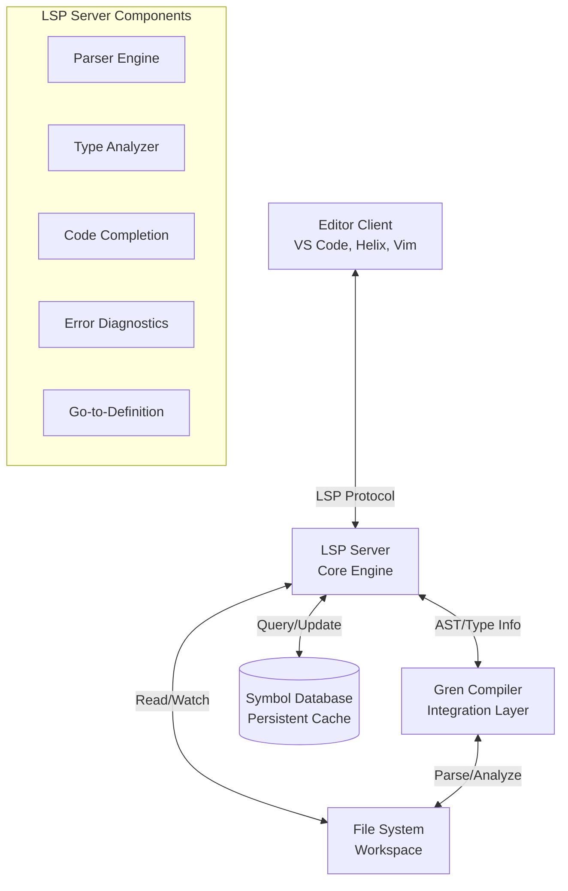
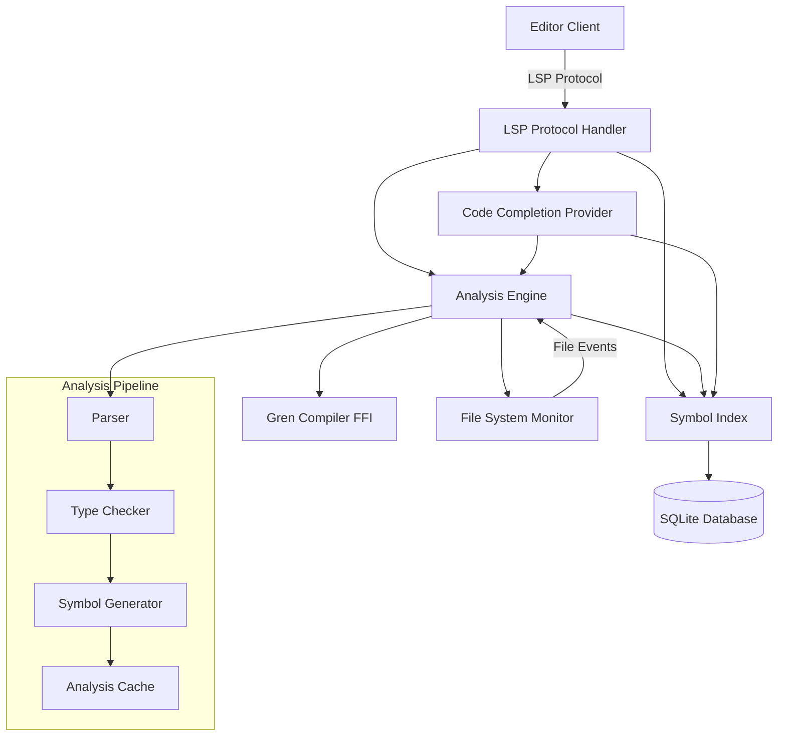
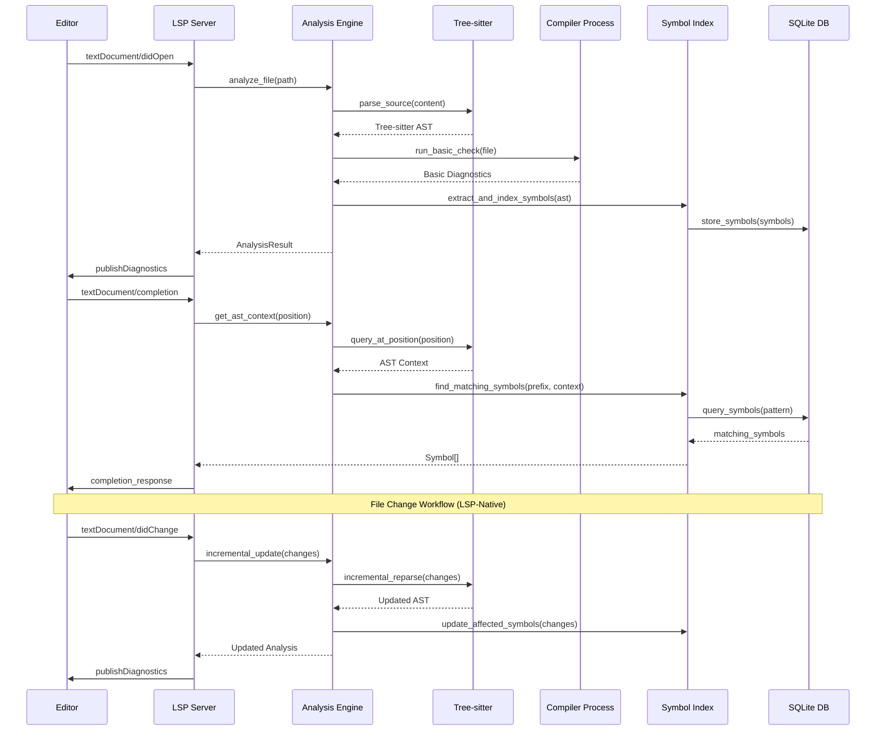

# Gren LSP Architecture Document

## Introduction

This document outlines the overall project architecture for Gren LSP, including backend systems, shared services, and non-UI specific concerns. Its primary goal is to serve as the guiding architectural blueprint for AI-driven development, ensuring consistency and adherence to chosen patterns and technologies.

**Gren Language Characteristics:**
Gren is a pure functional programming language forked from Elm with unique characteristics that significantly influence LSP architecture:
- **Immutable data structures** - Arrays as primary sequential type (not lists)
- **No runtime exceptions** - All errors handled through Maybe/Result types
- **Small, predictable syntax** - Minimal language constructs with clear semantics
- **Planned parametric modules** - Future module system changes
- **Referential transparency** - Functions always return same output for same input

**Relationship to Frontend Architecture:**
This project is primarily a Language Server Protocol implementation with minimal UI components (limited to VS Code extension and configuration interfaces). The core architecture focuses on the LSP server, tree-sitter integration, and editor communication protocols optimized for functional programming paradigms.

### Starter Template or Existing Project

**Decision: Custom Implementation from Scratch**

After reviewing the PRD requirements and the unique nature of LSP implementations, no existing starter template will be used. The Gren LSP requires:

- Deep integration with the Gren compiler's AST and type system
- Custom protocol handling for LSP communication
- Specialized parsing and analysis capabilities
- Performance-critical real-time processing

While LSP libraries exist for various languages, the tight coupling required with Gren's compiler and the need for language-specific optimizations make a custom implementation more appropriate. This approach allows for:

- Optimal performance tuning for Gren's functional paradigms
- Direct compiler integration without abstraction layers
- Custom caching and incremental compilation strategies
- Specialized handling of Gren's type system and module structure

### Change Log

| Date | Version | Description | Author |
|------|---------|-------------|---------|
| 2025-07-28 | 1.0 | Initial architecture document | Claude |

## High Level Architecture

### Technical Summary

The Gren LSP implementation follows a modular service-oriented architecture specifically optimized for pure functional programming paradigms. The system leverages Gren's unique characteristics - small syntax size, immutable data structures, and referential transparency - to create highly efficient language tooling. Phase 1 uses tree-sitter parsing optimized for Gren's minimal language constructs, with targeted compiler integration for diagnostics. The architecture respects functional programming principles by maintaining immutable analysis state and predictable operations. Core technology choices include Rust for performance, tree-sitter-gren for incremental parsing, and functional programming-aware analysis components that understand Gren's array-based data model and Maybe/Result error handling patterns.

### High Level Overview

**Architectural Style:** Modular Service Architecture with Event-Driven Communication
- **Repository Structure:** Monorepo approach to manage the LSP server, editor extensions, and shared tooling
- **Service Architecture:** Single high-performance LSP server with modular internal components
- **Primary Interaction Flow:** Editor ↔ LSP Server ↔ Gren Compiler ↔ File System
- **Key Architectural Decisions:**
  - Direct compiler integration for maximum accuracy and performance
  - Incremental analysis pipeline to handle large codebases efficiently  
  - Persistent symbol database for fast workspace-wide operations
  - Async message processing to prevent editor blocking
  - Extensible plugin system for future advanced features

### High Level Project Diagram

### Architectural and Design Patterns

- **Event-Driven Architecture:** Using async message processing for LSP communication to ensure non-blocking editor interactions - *Rationale:* Essential for maintaining responsive editing experience while performing complex analysis operations

- **Incremental Compilation Pattern:** Implementing dependency-aware partial recompilation to minimize processing overhead - *Rationale:* Critical for performance with large codebases, aligns with PRD requirement for real-time error checking

- **Repository Pattern:** Abstracting workspace and symbol storage behind well-defined interfaces - *Rationale:* Enables flexible storage backends and simplifies testing of analysis components

- **Observer Pattern:** Implementing file system watching with selective invalidation of analysis cache - *Rationale:* Provides efficient workspace synchronization without unnecessary recomputation

- **Pipeline Architecture:** Structuring analysis as composable stages (parse → analyze → index → cache) - *Rationale:* Allows for parallel processing and easier debugging of analysis issues

## Tree-sitter AST Structure

⚠️ **CRITICAL ARCHITECTURAL REQUIREMENT**: All symbol context determination MUST use tree-sitter AST analysis. For complete guidance on tree-sitter usage, AST structure, and mandatory policies, see [Tree-sitter AST Structure](./architecture/tree-sitter-ast-structure.md).

**Core Policy**: Text-based parsing (regex, string matching, manual parsing) is PROHIBITED for symbol context determination. The tree-sitter AST contains all necessary information about symbol locations, contexts, and relationships.

## Tech Stack

This section represents the definitive technology selection for the Gren LSP project. Each choice has been evaluated against the project requirements for performance, maintainability, and integration capabilities.

### Cloud Infrastructure

- **Provider:** None (Desktop/Local Development Tool)
- **Key Services:** Local file system, process management, inter-process communication
- **Deployment Regions:** Developer workstations globally

### Technology Stack Table

| Category | Technology | Version | Purpose | Rationale |
|----------|------------|---------|---------|-----------|
| **Core Language** | Rust | 1.70+ | LSP server implementation | Memory safety, zero-cost abstractions, excellent async performance, C interop for Gren compiler |
| **LSP Framework** | tower-lsp | 0.20.0 | Language Server Protocol implementation | Mature Rust LSP framework with async support and comprehensive protocol coverage |
| **Document Management** | lsp-textdocument | 0.3.0 | In-memory document tracking | Handles LSP text synchronization, incremental updates, and version management |
| **Async Runtime** | Tokio | 1.32.0 | Concurrent request handling | Industry standard async runtime, essential for non-blocking LSP operations |
| **Serialization** | serde | 1.0.185 | JSON-RPC protocol handling | Fast, type-safe serialization for LSP message processing |
| **Tree-sitter** | tree-sitter + tree-sitter-gren | Latest | Syntax parsing and AST generation | Fast, incremental parsing with existing Gren grammar support |
| **Database** | SQLite + rusqlite | 1.29.0 | Symbol indexing and caching | Embedded database for persistent symbol storage, no external dependencies |
| **Logging** | tracing | 0.1.37 | Diagnostic logging and performance monitoring | Structured logging with async support for debugging LSP operations |
| **Compiler Integration** | Process execution + output parsing | Limited | Basic diagnostics via compiler output | Phase 1 approach until official Gren compiler API is available |
| **Testing** | cargo test + criterion | 1.5.13 | Unit and performance testing | Built-in Rust testing with benchmarking for performance validation |
| **Build Tool** | Cargo | 1.70+ | Dependency management and builds | Standard Rust build system with excellent ecosystem integration |
| **Editor Extension** | TypeScript | 5.1.6 | VS Code extension development | Required for VS Code LSP client implementation |

## Gren-Specific LSP Considerations

Gren's pure functional nature and small language size create unique opportunities and constraints for LSP implementation:

### **Pure Functional Programming Advantages**

- **Total Function Purity:** ALL Gren functions are pure - effects are handled through Cmd types executed by the runtime, enabling complete memoization of function analysis and highly predictable behavior
- **Deterministic Analysis:** Referential transparency means function analysis is highly cacheable - same inputs always produce same outputs, with effects clearly separated through type system
- **Simplified State Management:** Immutable data structures eliminate entire classes of synchronization issues in the LSP server's internal state
- **Effect Transparency:** Effects are visible in type signatures (functions returning Cmd), making side-effect analysis explicit and comprehensive
- **Predictable Error Handling:** No exceptions mean all error cases are explicit in types (Maybe/Result), making diagnostic generation more straightforward and complete

### **Small Language Syntax Benefits**

- **Efficient Tree-sitter Parsing:** Minimal syntax means the tree-sitter grammar can be comprehensive and fast, with fewer edge cases and parsing ambiguities
- **Complete Symbol Resolution:** Limited language constructs make it feasible to implement near-complete symbol analysis even without full compiler API integration
- **Simplified Completion:** Fewer language constructs mean more focused and accurate code completion suggestions

### **Array-First Data Model Impact**

- **Performance Optimizations:** Gren's default use of arrays (not lists) aligns well with efficient symbol indexing and workspace analysis
- **Memory Layout:** Array-based symbol storage provides better cache locality for large codebases compared to linked list structures

### **Module System Evolution**

- **Future-Proof Architecture:** Design accommodates Gren's planned move to parametric modules, requiring flexible symbol resolution that can handle module generation at compile time
- **Incremental Migration:** Tree-sitter approach provides stability during Gren's ongoing language evolution

### **No-Exception Error Model**

- **Comprehensive Diagnostics:** All error cases are type-explicit, enabling the LSP to provide complete error coverage without missing runtime exception scenarios
- **Safe Refactoring:** Absence of exceptions makes automated refactoring operations safer and more predictable

## Data Models

The core data models represent the fundamental entities that the LSP server manages during analysis and interaction with editors.

### Workspace Model

**Purpose:** Represents the complete project workspace including all Gren source files, dependencies, and analysis state

**Key Attributes:**
- `root_path`: PathBuf - Root directory of the workspace
- `source_files`: HashMap<PathBuf, SourceFile> - All tracked Gren source files
- `dependencies`: Vec<Dependency> - External package dependencies
- `analysis_cache`: AnalysisCache - Cached analysis results for performance
- `symbol_index`: SymbolIndex - Global symbol database for cross-file operations

**Relationships:**
- Contains multiple SourceFile entities
- Manages dependency resolution across modules
- Maintains bidirectional references for efficient navigation

### SourceFile Model

**Purpose:** Represents a single Gren source file with its content, AST, and analysis metadata

**Key Attributes:**
- `text_document`: lsp_textdocument::FullTextDocument - LSP document with version tracking and incremental updates
- `path`: PathBuf - File system path (derived from text_document.uri)
- `ast`: TreeSitterAST - Tree-sitter parsed syntax tree
- `diagnostics`: Vec<Diagnostic> - Error and warning messages
- `symbols`: Vec<Symbol> - Symbols defined in this file
- `last_analyzed`: SystemTime - Last analysis timestamp

**Relationships:**
- Belongs to parent Workspace
- References symbols defined in other files through imports
- Contains multiple Symbol entities

### Symbol Model

**Purpose:** Represents language symbols (functions, types, variables) with their definitions and usage information, optimized for Gren's pure functional programming model

**Key Attributes:**
- `name`: String - Symbol identifier
- `kind`: GrenSymbolKind - Function, UnionType, TypeAlias, Variable, Module, etc.
- `location`: Location - Source position (file, line, column)
- `type_signature`: Option<GrenTypeSignature> - Type information including Maybe/Result patterns and Cmd types
- `documentation`: Option<String> - Associated documentation
- `visibility`: Visibility - Public, private, or module-internal
- `references`: Array<Location> - All usage locations (using Gren's array-first approach)
- `returns_cmd`: bool - Whether function returns a Cmd type for runtime effect execution
- `immutability`: bool - Whether symbol represents immutable data (always true for Gren values)

**Relationships:**
- Defined within a specific SourceFile
- May reference other symbols through type dependencies
- Tracked across files for go-to-definition and find-references

### Diagnostic Model

**Purpose:** Represents compiler errors, warnings, and suggestions with precise location information

**Key Attributes:**
- `severity`: DiagnosticSeverity - Error, Warning, Information, Hint
- `range`: Range - Source code range (start/end positions)
- `message`: String - Human-readable diagnostic message
- `code`: Option<String> - Compiler-specific error code
- `source`: String - Always "gren-lsp" for our diagnostics
- `related_information`: Vec<DiagnosticRelatedInformation> - Additional context

**Relationships:**
- Associated with specific SourceFile
- May reference related symbols for context
- Linked to compiler analysis results

## Components

The LSP server is architected as a collection of specialized components that work together to provide comprehensive language support.

### LSP Protocol Handler

**Responsibility:** Manages JSON-RPC communication with editor clients, routing requests to appropriate analysis components and formatting responses according to LSP specification

**Key Interfaces:**
- `initialize/initialized` - Client capability negotiation and server initialization
- `textDocument/*` - Document lifecycle and analysis requests  
- `workspace/*` - Workspace-wide operations and configuration changes

**Dependencies:** Analysis Engine, Symbol Index, Configuration Manager

**Technology Stack:** tower-lsp framework with tokio async runtime, serde for JSON serialization

### Analysis Engine

**Responsibility:** Coordinates parsing, type checking, and semantic analysis of Gren source code by interfacing with the Gren compiler and maintaining analysis state

**Key Interfaces:**
- `analyze_file(path: PathBuf) -> AnalysisResult` - Full file analysis
- `incremental_update(changes: Vec<TextEdit>) -> PartialResult` - Incremental reanalysis
- `get_diagnostics(path: PathBuf) -> Vec<Diagnostic>` - Error reporting

**Dependencies:** Gren Compiler FFI, File System Monitor, Symbol Index

**Technology Stack:** Direct Gren compiler integration via FFI, async processing pipeline

### Symbol Index

**Responsibility:** Maintains a searchable database of all symbols in the workspace, providing fast lookup for completion, navigation, and reference finding

**Key Interfaces:**
- `index_symbols(file: SourceFile) -> IndexResult` - Add/update file symbols
- `find_symbol(name: &str) -> Vec<Symbol>` - Symbol search
- `get_references(symbol: Symbol) -> Vec<Location>` - Find all references

**Dependencies:** SQLite database, Analysis Engine results

**Technology Stack:** SQLite with rusqlite bindings, custom indexing algorithms for Gren syntax

### Code Completion Provider

**Responsibility:** Generates context-aware code completion suggestions based on current cursor position, available symbols, and type information

**Key Interfaces:**
- `complete_at_position(doc: &Document, position: Position) -> CompletionList`
- `resolve_completion_item(item: CompletionItem) -> CompletionItem`

**Dependencies:** Symbol Index, Analysis Engine, Type System Integration

**Technology Stack:** Custom completion algorithms, integration with Gren type inference

### File System Monitor

**Responsibility:** Watches workspace files for changes and triggers appropriate cache invalidation and reanalysis operations

**Key Interfaces:**
- `watch_workspace(root: PathBuf) -> FileWatcher`
- `on_file_changed(path: PathBuf, event: FileEvent)` - Change notification handler

**Dependencies:** notify crate for file system events, Analysis Engine for invalidation

**Technology Stack:** notify library for cross-platform file watching, async event processing

### Component Diagrams

## External APIs

### Gren Compiler Integration

**Purpose:** Direct integration with Gren compiler for AST parsing, type checking, and error reporting

**Documentation:** Gren compiler source code and internal APIs (no external URL - direct source integration)
**Base URL(s):** N/A (FFI integration)
**Authentication:** N/A (local process integration)
**Rate Limits:** N/A (local calls)

**Key Integration Points:**
- `parse_module(source: &str) -> Result<AST, ParseError>` - Parse Gren source to AST
- `type_check_module(ast: AST, context: TypeContext) -> TypeResult` - Perform type analysis
- `get_module_dependencies(module: &Module) -> Vec<ModuleName>` - Extract import dependencies

**Integration Notes:** Requires careful memory management at FFI boundary, error handling for malformed source, and efficient serialization of AST structures

### Language Server Protocol Specification

**Purpose:** Adherence to LSP specification for editor communication standards

**Documentation:** https://microsoft.github.io/language-server-protocol/
**Base URL(s):** JSON-RPC over stdio/TCP
**Authentication:** N/A (process communication)
**Rate Limits:** N/A (local communication)

**Key Protocol Methods:**
- `initialize` - Server capability negotiation
- `textDocument/completion` - Code completion requests
- `textDocument/definition` - Go-to-definition requests
- `textDocument/publishDiagnostics` - Error reporting to client

**Integration Notes:** Must maintain protocol version compatibility, handle client capability differences, implement proper error responses

### Tree-sitter Grammar Integration

**Purpose:** Fast, incremental parsing using existing tree-sitter-gren grammar

**Documentation:** https://github.com/MaeBrooks/tree-sitter-gren
**Base URL(s):** N/A (embedded library)
**Authentication:** N/A
**Rate Limits:** N/A

**Key Integration Points:**
- `ts_parser_parse()` - Parse Gren source with tree-sitter
- `ts_tree_get_changed_ranges()` - Efficient incremental parsing
- Custom query patterns for symbol extraction and syntax highlighting

**Integration Notes:** Grammar is still in development by MaeBrooks. May require contributions or local modifications for complete Gren language support. This provides the foundation for Phase 1 implementation while preparing for eventual full compiler integration.

## Core Workflows

## REST API Spec

N/A - This project implements the Language Server Protocol over JSON-RPC, not REST APIs. All communication follows the LSP specification for message-based communication between editors and language servers.

## Performance Considerations

### Startup Time Optimization
- **Symbol Index Persistence:** Pre-built symbol database reduces initial workspace analysis time
- **Lazy Loading:** Core LSP features available immediately, advanced analysis loaded incrementally
- **Parallel Initialization:** File parsing and indexing performed concurrently during startup

### Memory Management
- **Incremental Analysis:** Only reanalyze changed files and their dependents
- **LRU Caching:** Bounded memory usage for AST and analysis results
- **Efficient Data Structures:** Compact representations for symbols and type information

### Real-time Responsiveness
- **Async Processing:** Non-blocking request handling for editor responsiveness
- **Request Prioritization:** Interactive operations (completion, hover) prioritized over background analysis
- **Debounced Updates:** Batch rapid file changes to prevent analysis thrashing

## Error Handling Strategy

### Graceful Degradation
- **Partial Analysis:** Provide available information even when full analysis fails
- **Error Recovery:** Continue operation despite individual file parsing failures
- **Fallback Mechanisms:** Basic syntax highlighting when semantic analysis unavailable

### Diagnostic Reporting
- **Structured Errors:** Rich diagnostic information with precise location data
- **Error Categories:** Distinguish between syntax errors, type errors, and LSP internal errors
- **Progressive Disclosure:** Summary diagnostics with detailed information on request

This architecture provides a solid foundation for implementing a high-performance, feature-rich Language Server Protocol implementation for the Gren programming language, addressing all requirements outlined in the PRD while maintaining focus on developer experience and system performance.