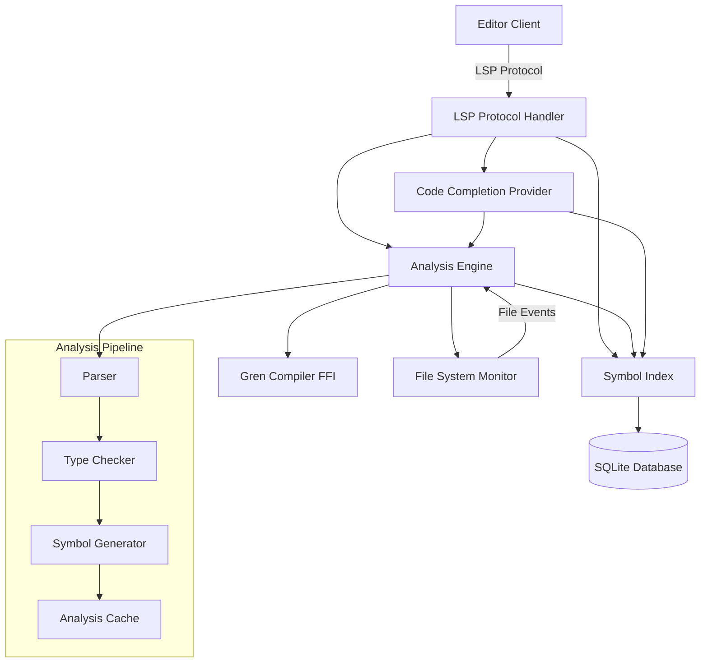

# Components

The LSP server is architected as a collection of specialized components that work together to provide comprehensive language support.

## LSP Protocol Handler

**Responsibility:** Manages JSON-RPC communication with editor clients, routing requests to appropriate analysis components and formatting responses according to LSP specification

**Key Interfaces:**
- `initialize/initialized` - Client capability negotiation and server initialization
- `textDocument/*` - Document lifecycle and analysis requests  
- `workspace/*` - Workspace-wide operations and configuration changes

**Dependencies:** Analysis Engine, Symbol Index, Configuration Manager

**Technology Stack:** tower-lsp framework with tokio async runtime, serde for JSON serialization

## Analysis Engine

**Responsibility:** Coordinates parsing, type checking, and semantic analysis of Gren source code by interfacing with the Gren compiler and maintaining analysis state

**Key Interfaces:**
- `analyze_file(path: PathBuf) -> AnalysisResult` - Full file analysis
- `incremental_update(changes: Vec<TextEdit>) -> PartialResult` - Incremental reanalysis
- `get_diagnostics(path: PathBuf) -> Vec<Diagnostic>` - Error reporting

**Dependencies:** Gren Compiler FFI, File System Monitor, Symbol Index

**Technology Stack:** Direct Gren compiler integration via FFI, async processing pipeline

## Symbol Index

**Responsibility:** Maintains a searchable database of all symbols in the workspace, providing fast lookup for completion, navigation, and reference finding

**Key Interfaces:**
- `index_symbols(file: SourceFile) -> IndexResult` - Add/update file symbols
- `find_symbol(name: &str) -> Vec<Symbol>` - Symbol search
- `get_references(symbol: Symbol) -> Vec<Location>` - Find all references

**Dependencies:** SQLite database, Analysis Engine results

**Technology Stack:** SQLite with rusqlite bindings, custom indexing algorithms for Gren syntax

## Code Completion Provider

**Responsibility:** Generates context-aware code completion suggestions based on current cursor position, available symbols, and type information

**Key Interfaces:**
- `complete_at_position(doc: &Document, position: Position) -> CompletionList`
- `resolve_completion_item(item: CompletionItem) -> CompletionItem`

**Dependencies:** Symbol Index, Analysis Engine, Type System Integration

**Technology Stack:** Custom completion algorithms, integration with Gren type inference

## File System Monitor

**Responsibility:** Watches workspace files for changes and triggers appropriate cache invalidation and reanalysis operations

**Key Interfaces:**
- `watch_workspace(root: PathBuf) -> FileWatcher`
- `on_file_changed(path: PathBuf, event: FileEvent)` - Change notification handler

**Dependencies:** notify crate for file system events, Analysis Engine for invalidation

**Technology Stack:** notify library for cross-platform file watching, async event processing

## Component Diagrams

