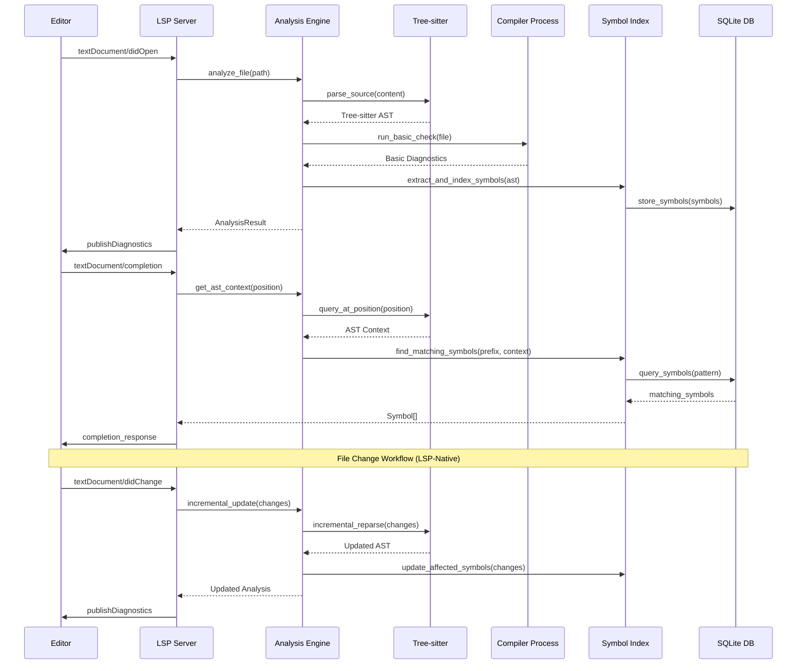

# Core Workflows

```mermaid
sequenceDiagram
    participant Editor
    participant LSP as LSP Server
    participant Engine as Analysis Engine  
    participant TreeSitter as Tree-sitter
    participant CompilerProc as Compiler Process
    participant Index as Symbol Index
    participant DB as SQLite DB

    Editor->>LSP: textDocument/didOpen
    LSP->>Engine: analyze_file(path)
    Engine->>TreeSitter: parse_source(content)
    TreeSitter-->>Engine: Tree-sitter AST
    Engine->>CompilerProc: run_basic_check(file)
    CompilerProc-->>Engine: Basic Diagnostics
    Engine->>Index: extract_and_index_symbols(ast)
    Index->>DB: store_symbols(symbols)
    Engine-->>LSP: AnalysisResult
    LSP->>Editor: publishDiagnostics

    Editor->>LSP: textDocument/completion
    LSP->>Engine: get_ast_context(position)
    Engine->>TreeSitter: query_at_position(position)
    TreeSitter-->>Engine: AST Context
    Engine->>Index: find_matching_symbols(prefix, context)
    Index->>DB: query_symbols(pattern)
    DB-->>Index: matching_symbols
    Index-->>LSP: Symbol[]
    LSP->>Editor: completion_response

    Note over Editor,DB: File Change Workflow (LSP-Native)
    Editor->>LSP: textDocument/didChange
    LSP->>Engine: incremental_update(changes)
    Engine->>TreeSitter: incremental_reparse(changes)
    TreeSitter-->>Engine: Updated AST
    Engine->>Index: update_affected_symbols(changes)
    Engine-->>LSP: Updated Analysis
    LSP->>Editor: publishDiagnostics
```
