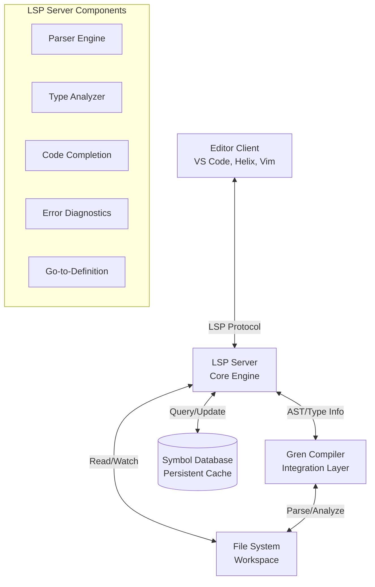

# High Level Architecture

## Technical Summary

The Gren LSP implementation follows a modular service-oriented architecture specifically optimized for pure functional programming paradigms. The system leverages Gren's unique characteristics - small syntax size, immutable data structures, and referential transparency - to create highly efficient language tooling. Phase 1 uses tree-sitter parsing optimized for Gren's minimal language constructs, with targeted compiler integration for diagnostics. The architecture respects functional programming principles by maintaining immutable analysis state and predictable operations. Core technology choices include Rust for performance, tree-sitter-gren for incremental parsing, and functional programming-aware analysis components that understand Gren's array-based data model and Maybe/Result error handling patterns.

## High Level Overview

**Architectural Style:** Modular Service Architecture with Event-Driven Communication
- **Repository Structure:** Monorepo approach to manage the LSP server, editor extensions, and shared tooling
- **Service Architecture:** Single high-performance LSP server with modular internal components
- **Primary Interaction Flow:** Editor ↔ LSP Server ↔ Gren Compiler ↔ File System
- **Key Architectural Decisions:**
  - Direct compiler integration for maximum accuracy and performance
  - Incremental analysis pipeline to handle large codebases efficiently  
  - Persistent symbol database for fast workspace-wide operations
  - Async message processing to prevent editor blocking
  - Extensible plugin system for future advanced features

## High Level Project Diagram

## Architectural and Design Patterns

- **Event-Driven Architecture:** Using async message processing for LSP communication to ensure non-blocking editor interactions - *Rationale:* Essential for maintaining responsive editing experience while performing complex analysis operations

- **Incremental Compilation Pattern:** Implementing dependency-aware partial recompilation to minimize processing overhead - *Rationale:* Critical for performance with large codebases, aligns with PRD requirement for real-time error checking

- **Repository Pattern:** Abstracting workspace and symbol storage behind well-defined interfaces - *Rationale:* Enables flexible storage backends and simplifies testing of analysis components

- **Observer Pattern:** Implementing file system watching with selective invalidation of analysis cache - *Rationale:* Provides efficient workspace synchronization without unnecessary recomputation

- **Pipeline Architecture:** Structuring analysis as composable stages (parse → analyze → index → cache) - *Rationale:* Allows for parallel processing and easier debugging of analysis issues
