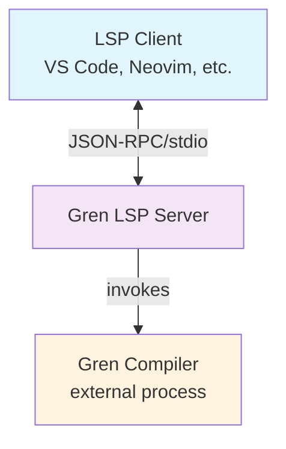

# High-Level Architecture

```mermaid
graph TD
    A[LSP Client<br/>VS Code, Neovim, etc.] <-->|JSON-RPC/stdio| B[Gren LSP Server]
    B -->|invokes| C[Gren Compiler<br/>external process]
    
    style A fill:#e1f5fe
    style B fill:#f3e5f5
    style C fill:#fff3e0
```
